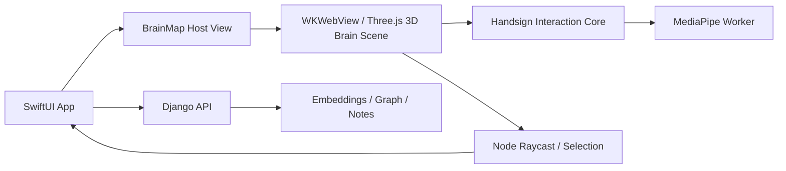

# SBrain 3D Brain Map + Handsign Integration Proposal

## 문서 목적

이 문서는 기존 `SBrain`에 다음 기능을 추가하기 위한 개발 제안서입니다.

- 2D Brain Map을 3D Brain Map으로 확장
- 손 인식을 이용해 노드를 hover/select/open
- 기존 `handsign` 프로젝트의 손 추론 및 인터랙션 코어를 최대한 재사용

핵심 방향은 `SBrain의 정보 구조`는 유지하고, `handsign의 입력 처리와 실시간 인터랙션 레이어`를 이식하는 것입니다.

---

## 한 줄 제안

가장 현실적인 방식은 다음과 같습니다.

1. `handsign`의 MediaPipe worker + gesture mapper를 재사용 가능한 입력 모듈로 분리한다.
2. `SBrain`의 Brain Map을 Three.js 기반 3D 뷰로 확장한다.
3. 손 좌표를 마우스 포인터처럼 쓰는 것이 아니라, `3D 그래프 선택용 raycast 입력`으로 사용한다.
4. 노트 상세, 폴더 트리, 검색 UI는 기존 SwiftUI/Django 구조를 그대로 유지한다.

즉, `SBrain 전체를 handsign으로 바꾸는 것`이 아니라, `SBrain 안에 handsign의 interaction engine을 넣는 방식`을 권장합니다.

---

## 왜 handsign을 활용하기 좋은가

현재 `handsign`에는 이미 아래 요소가 준비되어 있습니다.

- `src/workers/inference.worker.ts`
  - MediaPipe Gesture Recognizer를 worker에서 실행
  - UI 스레드 블로킹을 줄이는 구조가 이미 있음
- `src/features/inference/inference-bridge.ts`
  - 메인 스레드와 worker 사이 메시지 브리지
  - 프레임 전송, 초기화, dispose 흐름이 정리되어 있음
- `src/features/gestures/gesture-mapper.ts`
  - 랜드마크 결과를 `pinch`, `pointer`, `palmCenter`, `sceneMode` 같은 앱 친화적인 상태로 변환
- `src/features/inference/inference-types.ts`
  - 추론 결과와 상호작용 상태 타입 정의
- `src/features/session/use-session-controller.ts`
  - 카메라, 추론, 렌더링 루프, 리소스 정리 패턴이 정리되어 있음
- `src/features/visual/visual-engine.ts`
  - Three.js 기반 실시간 시각화
  - 포인터 위치를 월드 좌표에 반영하는 로직과 부드러운 보간 패턴이 있음

재사용 가치가 높은 것은 `손 추론`, `제스처 상태화`, `실시간 입력 루프`이고, 재사용 가치가 낮은 것은 `오디오`, `스포츠 랩`, `현재 HUD UI`입니다.

---

## 권장 아키텍처

### 권장안: 하이브리드 통합

- macOS 앱 셸: SwiftUI 유지
- 노트/폴더/검색/백엔드 통신: 기존 SBrain 구조 유지
- 3D Brain Map 렌더링 + 손 추론: 웹 기반 인터랙션 모듈로 분리
- 브리지: `SwiftUI <-> WKWebView(JavaScript)` 메시지 브리지



이 구조의 장점은 아래와 같습니다.

- `handsign` 코드를 가장 적게 버리고 가장 빨리 재사용할 수 있음
- Three.js와 MediaPipe를 이미 웹에서 검증한 방식대로 유지 가능
- SBrain의 기존 SwiftUI 화면 구조를 크게 흔들지 않음
- 초기에는 3D Brain Map만 web view에서 그리고, 나머지 UI는 native로 유지 가능

---

## 대안 비교

### A안. WKWebView 안에 handsign 코어 + 3D Brain Map 탑재

권장도: 가장 높음

- 장점
  - 기존 `handsign` 코드 재사용률이 가장 높음
  - 프로토타이핑이 빠름
  - Three.js와 hand tracking을 같은 런타임에서 다루기 쉬움
- 단점
  - macOS 앱의 카메라 권한과 WKWebView 설정을 별도로 다뤄야 함
  - SwiftUI와 JS 간 브리지 설계가 필요함

### B안. 손 추론만 native로 다시 구현하고 Brain Map만 3D화

권장도: 중장기용

- 장점
  - macOS 앱과 권한/성능/배포 측면에서 더 안정적일 수 있음
  - AVFoundation/Vision으로 자연스럽게 통합 가능
- 단점
  - `handsign` 코드를 직접 재사용하기 어렵고 사실상 재구현이 많아짐
  - 초기에 개발 속도가 느려짐

### 결론

1차 구현은 A안으로 시작하고,
성능/권한/배포 이슈가 실제로 커질 때 B안을 검토하는 방식이 가장 안전합니다.

---

## handsign에서 실제로 가져갈 범위

### 그대로 재사용 추천

- 추론 워커 구조
- Gesture Recognizer 초기화 로직
- `InferenceResult -> InteractionState` 변환 로직
- pinch 계산과 smoothing
- 세션 start/stop/dispose 패턴
- Three.js 기반 입력 연동 방식

### 부분 수정 후 재사용 추천

- `pointer`를 2D 장면 포인터가 아니라 `raycast 입력`으로 바꾸기
- `sceneMode`를 SBrain 기능에 맞는 interaction mode로 재정의
- `VisualEngine`의 입자 장면 대신 `BrainGraph3DEngine`으로 교체

### 제외 추천

- `AudioEngine`
- 스포츠 모드 관련 엔진
- 현재 Handsign 전용 HUD/스타일/UI

---

## SBrain에 추가될 핵심 기능 정의

### 1. 3D Brain Map

- 노트를 3D 공간의 노드로 렌더링
- 노드 간 유사도를 시냅스 라인으로 렌더링
- 카메라 orbit, zoom, focus 지원
- 선택된 노드는 강조 표시
- hover 상태에서 preview tooltip 또는 side preview 표시

### 2. Hand Interaction

- 손이 보이면 커서 대신 손 포인터를 사용
- index finger 또는 palm 기반의 화면 좌표를 raycast 입력으로 변환
- pinch hold로 노드 선택
- open palm으로 카메라 이동 모드
- victory 또는 closed fist를 상세 열기/고정 같은 명령에 매핑

### 3. Hybrid Navigation

- 손 입력이 불안정할 때는 마우스/트랙패드 입력 즉시 사용 가능
- 손 입력은 `보조 입력`으로 설계
- 모든 기능은 손 없이도 동작해야 함

이 원칙이 중요합니다. 손 인식은 UX를 강화하는 기능이지, 기본 탐색 수단을 대체하면 안 됩니다.

---

## 권장 제스처 매핑

현재 handsign이 가진 입력 상태를 기준으로 다음 매핑을 추천합니다.

| Handsign 상태 | SBrain 동작 | 비고 |
|---|---|---|
| `tracking` | hover / raycast 포인터 이동 | 기본 상태 |
| `pinch-focus` | 현재 hover 노드 선택 | `200~350ms hold` 필요 |
| `open-palm` | 카메라 orbit 또는 pan | 선택 액션과 분리 |
| `closed-fist` | 그래프 drag 또는 cluster move | 선택 기능과 충돌 시 제외 가능 |
| `victory-flare` | 노트 열기 / focus lock | 명령성 액션에 적합 |

실제 MVP에서는 아래처럼 더 단순하게 가는 편이 좋습니다.

- `tracking`: 포인터 이동
- `pinch`: 선택
- `open palm`: 카메라 이동
- `victory`: 상세 열기

이 4가지만 먼저 안정화하는 것을 권장합니다.

---

## 3D Brain Map 데이터 계약

현재 SBrain은 PCA 2D 투영을 사용하고 있습니다. 3D 모드에서는 백엔드가 최소 아래 정보를 제공해야 합니다.

```json
{
  "nodes": [
    {
      "id": "note_42",
      "title": "Project Notes",
      "path": "/notes/project.md",
      "cluster": "work",
      "x": 0.12,
      "y": -0.43,
      "z": 0.31,
      "size": 1.4,
      "preview": "첫 문단 요약...",
      "tags": ["research", "swift"]
    }
  ],
  "edges": [
    {
      "source": "note_42",
      "target": "note_99",
      "weight": 0.82
    }
  ]
}
```

### 백엔드 변경 제안

- 기존 `/api/graph/`를 확장하거나 `/api/graph/3d/` 추가
- 반환 데이터에 `x`, `y`, `z`, `size`, `cluster`, `preview` 포함
- threshold 외에 `max_edges`, `layout`, `cluster_by` 같은 파라미터 지원

예시:

- `GET /api/graph/3d/?layout=umap&threshold=0.55`
- `GET /api/graph/3d/?layout=pca3&max_edges=400`

### 레이아웃 권장 순서

1. 1차: `PCA 3D` 또는 `TruncatedSVD 3D`
2. 2차: `UMAP 3D`
3. 3차: force-directed refinement 추가

초기에는 계산 안정성과 구현 속도 때문에 `PCA 3D`로 시작하는 것이 좋습니다.

---

## 프론트엔드/앱 구조 제안

### SwiftUI 쪽

- `BrainMapContainerView`
  - 3D Brain Map 호스트
  - JS bridge 이벤트 수신
- `NoteDetailPane`
  - 기존 마크다운 상세 뷰 유지
- `FolderSidebar`
  - 기존 폴더 탐색 유지
- `SearchBar`
  - 기존 Recall 검색 유지

### Web Interaction Module 쪽

- `BrainGraph3DEngine`
  - Three.js scene, camera, node/edge rendering
- `HandInteractionController`
  - handsign에서 가져온 inference bridge + worker + gesture mapping
- `BrainMapBridge`
  - SwiftUI와 데이터 송수신
- `NodeRaycastController`
  - 손 포인터와 마우스를 모두 동일한 선택 계층으로 처리

핵심은 `입력 계층`, `렌더링 계층`, `선택 계층`을 분리하는 것입니다.

---

## 추천 이벤트 계약

### JS -> SwiftUI

- `brainMapReady`
- `hoverNodeChanged`
- `nodeSelected`
- `nodeOpened`
- `gestureStateChanged`
- `cameraPermissionChanged`
- `interactionError`

### SwiftUI -> JS

- `loadGraph(data)`
- `highlightNode(id)`
- `focusNode(id)`
- `setInteractionEnabled(boolean)`
- `setTheme(theme)`
- `openSearchResults(ids)`

이 계약을 먼저 정해두면 나중에 Brain Map을 native 렌더러로 바꾸더라도 상위 UI는 덜 흔들립니다.

---

## 구현 순서 제안

## Phase 0. 기술 검증

- macOS 앱의 `WKWebView + getUserMedia + MediaPipe` 동작 확인
- Three.js 3D scene이 앱 안에서 안정적으로 렌더링되는지 확인
- SwiftUI와 JS 브리지 왕복 테스트

### 완료 기준

- 카메라 권한 허용 후 손 추론 결과를 앱 안에서 받을 수 있음
- 샘플 3D 노드 100개를 렌더링 가능
- 손 포인터 또는 마우스로 노드 hover 가능

## Phase 1. Handsign 코어 분리

- `handsign`에서 아래 모듈을 별도 패키지 또는 독립 폴더로 추출
  - `inference-types`
  - `inference-bridge`
  - `inference.worker`
  - `gesture-mapper`
  - 카메라 세션 lifecycle 일부
- UI 의존성 제거
- SBrain용 설정값 분리

### 완료 기준

- SBrain 외부에서도 재사용 가능한 `hand-interaction-core` 형태 확보

## Phase 2. 3D Brain Map MVP

- Django에서 3D graph endpoint 제공
- Three.js 기반 Brain Graph 렌더러 구현
- node hover/select/open 동작 구현
- 마우스 입력 우선 동작

### 완료 기준

- 3D 그래프 탐색 가능
- 노드 클릭 시 우측 노트 상세 뷰 열림

## Phase 3. 손 입력 연결

- 손 포인터 -> raycast 연결
- pinch hold -> select
- victory -> open
- open palm -> orbit/pan
- smoothing, deadzone, dwell time 조정

### 완료 기준

- 손만으로 기본 노트 탐색이 가능
- 오작동률이 과도하지 않음

## Phase 4. 안정화

- 프레임 드랍 측정
- 대규모 노트셋 최적화
- 손 추적 실패 시 마우스 입력으로 자연스럽게 복귀
- 설정 UI 추가

### 설정 예시

- hand interaction on/off
- dominant hand
- pinch sensitivity
- dwell time
- graph density

---

## 성능 권장사항

- 손 추론은 반드시 worker 유지
- 그래프 노드가 많으면 instancing 검토
- edge는 전체 상시 렌더링보다 `선택/hover 주변만 강조`하는 방식 권장
- 노드 수가 많으면 `LOD` 또는 `cluster aggregation` 적용
- 3D layout은 매번 다시 계산하지 말고 폴더별 캐시 권장

### 실무 기준 추천

- 300개 이하 노드: MVP 범위에서 충분히 가능
- 300~1500개 노드: edge 수 제한 필요
- 1500개 이상 노드: 클러스터 단계 표현 또는 progressive loading 필요

---

## UX 권장사항

- 손 포인터가 활성화되면 시각적으로 명확한 cursor orb 표시
- 선택은 즉시 pinch보다 `짧은 hold`를 두어 오작동 감소
- 손이 화면에서 사라지면 마지막 선택 상태는 유지하고 포인터만 숨김
- 손 추적 신뢰도가 낮을 때는 pointer jitter를 그대로 쓰지 말고 freeze 또는 fade
- 검색 결과 노드는 별도 색상/링으로 강조

손 인식 인터랙션은 "멋있어 보이는 것"보다 "실제로 덜 피곤한 것"이 더 중요합니다.

---

## 예상 리스크와 대응

### 1. WKWebView 카메라 권한 이슈

- 리스크
  - macOS 앱 내부 web view에서 카메라 접근 설정이 까다로울 수 있음
- 대응
  - Phase 0에서 가장 먼저 검증
  - 막히면 native camera capture + JS scene 조합으로 전환

### 2. 손 포인터 오작동

- 리스크
  - hover와 select가 과도하게 튈 수 있음
- 대응
  - dwell time
  - smoothing
  - deadzone
  - confidence threshold

### 3. 3D 그래프 가독성 저하

- 리스크
  - 2D보다 멋있지만 실제 탐색은 어려울 수 있음
- 대응
  - 기본 카메라 preset 제공
  - 검색/선택 노드 자동 focus
  - 클러스터 색상과 depth fog 사용

### 4. 대규모 그래프 성능 저하

- 리스크
  - 시냅스 선과 텍스트 렌더링이 병목이 될 수 있음
- 대응
  - edge pruning
  - text label 최소화
  - hover/selection 시에만 상세 라벨 노출

---

## 개발팀에 권장하는 최종 방향

### 추천 전략

- `SBrain의 제품 구조`는 유지
- `handsign`은 독립적인 hand interaction core로 추출
- 1차 릴리스는 `WKWebView + Three.js + MediaPipe` 기반으로 구현
- 손 입력은 마우스를 대체하지 말고 보조 입력으로 제공
- 3D Brain Map은 먼저 `PCA 3D + 선택/열기`에 집중하고, 이후 UMAP/군집 강화

### 하지 않는 것이 좋은 것

- 처음부터 모든 뷰를 100% 3D로 바꾸는 것
- 손 제스처를 너무 많이 도입하는 것
- 손 입력 없이는 탐색이 불가능한 UX
- 초기에 native 렌더러와 web 렌더러를 동시에 크게 만드는 것

---

## 바로 착수 가능한 작업 목록

1. SBrain macOS 앱에서 `WKWebView` 카메라 접근이 가능한지 검증
2. `handsign`의 worker/bridge/gesture-mapper를 분리 가능한 구조로 정리
3. SBrain backend에 3D graph endpoint 설계
4. Three.js로 샘플 Brain Graph 3D 렌더러 구현
5. 마우스 기반 raycast selection 먼저 완성
6. 이후 손 포인터 입력을 연결

---

## 요약

이 기능은 충분히 구현 가능합니다. 다만 성공 포인트는 "손 인식" 자체가 아니라 아래 세 가지입니다.

- `handsign`의 입력 처리 코어를 재사용 가능한 모듈로 분리할 것
- `3D Brain Map`을 독립된 선택 가능한 그래프 뷰로 설계할 것
- `손 입력은 보조 인터랙션`으로 도입해 실제 사용성을 해치지 않을 것

이 방향으로 가면 SBrain은 기존의 로컬-퍼스트 노트 탐색 구조를 유지하면서도, "뇌 속을 손으로 직접 더듬는" 경험을 꽤 설득력 있게 구현할 수 있습니다.
